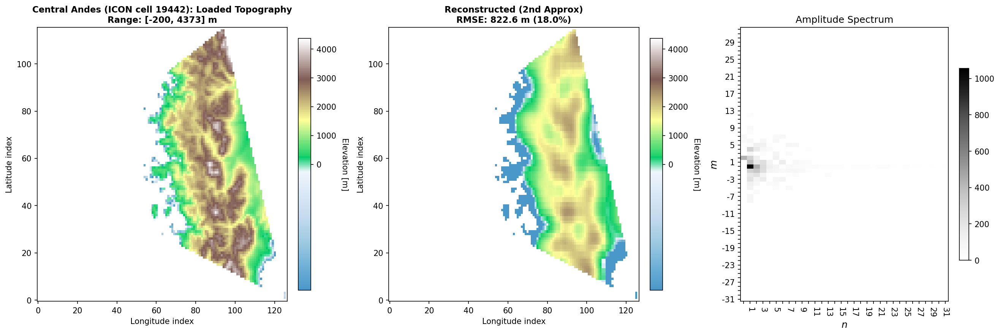

Showcase: ETOPO over the central Andes
======================================

A real-data companion to the :doc:`idealised tutorial <tutorial>`. Where the
tutorial recovers a *synthetic* spectrum whose answer is known a priori, this
example runs the full CSA pipeline on a real ICON grid cell over the **central
Andes near Aconcagua (~32°S)** — a strong orographic gravity-wave source with
dramatic coast-to-summit relief (Pacific shelf to ~4.4 km summits in a single
cell).

It ships with everything it needs (``examples/data/etopo_andes/`` is ~130 KB: a
single-cell ICON grid subset plus a coarse-grained ETOPO slice), so a reviewer
or new user can clone and run it in a few seconds — no data download.

Run it
------

After ``pip install -e .``::

    python examples/icon_etopo_andes.py

It prints the top mode amplitudes and the spectrum shape, then writes a
three-panel diagnostic figure to ``examples/output/icon_etopo_andes.png``. The
numerics are computed live (not pinned), so they will differ slightly across
LAPACK builds — this script is for human inspection, not regression gating.

What this adds over the idealised tutorial
------------------------------------------

The CSA *algorithm* is identical to the tutorial (first approximation → top-N
mode selection → constrained second approximation via
:class:`pycsa.wrappers.interface.get_pmf`). What's new here is everything
*around* it — the parts that make it a real, production-shaped run:

* **Real ETOPO topography** loaded through the production loader
  :meth:`pycsa.core.io.ncdata.read_etopo_topo` — the same data path the global
  HPC pipeline uses, including the bounding-tile assembly across the two bundled
  ETOPO slices.

* **Ocean-aware masking.** ETOPO carries bathymetry, so the cell spans sea floor
  to summit. The example clamps deep bathymetry to −500 m for the spectral fit,
  then **excludes ocean below −200 m from the analysis mask** — the atmosphere
  "sees" the sea surface, not the seafloor. In the figure, deep ocean and the
  cell exterior render white; the shallow shelf (−200…0 m) stays blue. This
  mirrors ``runs/icon_etopo_global.py`` exactly.

* **The production diagnostic plot.** The figure is rendered by
  :func:`pycsa.plotting.diagnostics.plot_cell_diagnostics` — the *same* routine
  the global run emits per cell, with the same ocean-aware colormap. So the
  figure below is representative of what a global run produces for any land cell.

   Left: the loaded ETOPO topography for the cell (ocean-aware colormap;
   shelf in blue, summits in brown). Middle: the CSA second-approximation
   reconstruction from the selected modes, with its RMSE. Right: the amplitude
   spectrum on the ``n`` × ``m`` (64 × 32) wavenumber grid — a sparse set of
   modes carries most of the energy, which is the whole point of the
   constrained approximation.

Where this fits
---------------

This is **one cell** of what :doc:`hpc_reproducibility` runs over all 20,480
cells of the ICON R02B04 grid — same ETOPO loader, same ocean masking, same
per-cell diagnostic plot, just wrapped in Dask memory-batching and a worker-local
tile cache (:class:`pycsa.compute.context.ComputeContext`). If you want to see
the method scale up, that page is the next step.

The two hardest "corner" cells — a false-positive-dateline cell and a south-pole
cell — are pinned by the reproducibility suite at ``tests/reproducibility/`` and
gated in CI; the numerics here are deliberately left live for inspection.
