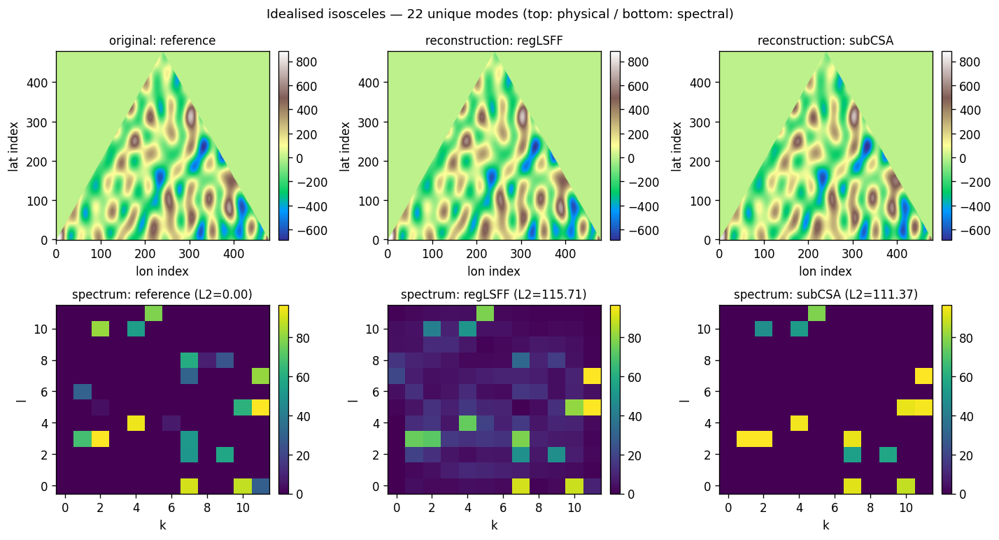

Tutorial: Idealised isosceles experiment
========================================

This walkthrough follows the canonical idealised CSA experiment in
:mod:`runs.idealised_isosceles`. It generates a synthetic terrain whose
spectrum is known a priori, then runs four ways of recovering that
spectrum from the (masked) topography:

* a **pure least-squares Fourier fit** (pLSFF), unregularised — kept for
  comparison with the JAMES 2024 baseline;
* a **regularised** LSFF (regLSFF);
* the **optimal** Constrained Spectral Approximation (optCSA) with the
  known mode count;
* a **sub-optimal** CSA (subCSA) that's told to recover fewer modes
  than the terrain actually has.

Running the script as-is reproduces all four spectra plus the reference
in a single call. After ``pip install -e .`` it's one command::

    pycsa-idealised

The script is deterministic (``np.random.seed(777)``) so the numerical
output is the same on every run, modulo cross-LAPACK drift in pLSFF.

Step 1 — Generate a synthetic terrain
-------------------------------------

The terrain is built from a sum of cosines and sines on a regular
``(lon, lat)`` mesh inside an isosceles triangle cell. The seeded
generator picks 22 unique ``(k, l)`` mode coordinates and per-mode
amplitudes ``Ak``:

.. code-block:: python

    pts, nk, nl, Ak, Al, sck, _scl = _generate_terrain(seed=777)
    # pts: array of 22 unique (k, l) wavenumber pairs
    # Ak:  per-mode amplitudes in [0, 100)
    # sck: 0 → cosine basis, 1 → sine basis

These determine the reference spectrum ``freqs_ref`` directly — the
spectrum the four estimators below are trying to recover.

Step 2 — Build the cell + paint topography
------------------------------------------

:func:`pycsa.core.utils.isosceles` returns the vertex indices of an
isosceles triangle in the underlying meshgrid; the cell is masked to
that triangle:

.. code-block:: python

    grid = var.grid()
    cell = var.topo_cell()
    vid = utils.isosceles(grid, cell)
    lat_v, lon_v = grid.clat_vertices[vid], grid.clon_vertices[vid]
    cell.gen_mgrids()

    # paint the sum of basis functions
    cell.topo = sum(Ak[i] * basis(nk[i], nl[i], …) for i in range(22))

    triangle = utils.gen_triangle(lon_v, lat_v)
    cell.get_masked(triangle=triangle)

See :class:`pycsa.data.cell.topo_cell` for the cell container and
:func:`pycsa.core.utils.gen_triangle` for the triangle mask.

Step 3 — Pure LSFF (broken, but informative)
--------------------------------------------

The unregularised least-squares fit uses every wavenumber in the
spectrum and over-fits dramatically:

.. code-block:: python

    pure_lsff = interface.get_pmf(nhi=12, nhj=12, U=1.0, V=1.0)
    freqs_pLSFF, _, _ = pure_lsff.sappx(cell, lmbda=0.0, iter_solve=False)

L2 error against the reference is ``≈164,000`` — pLSFF's amplitudes blow
up because the design matrix is rank-deficient on the triangle support.
This is the failure mode that motivates regularisation and mode
selection.

.. note::

   pLSFF is the only experiment whose absolute amplitudes drift
   across LAPACK builds (the reproducibility suite uses ``rtol=1e-2``
   for the four pLSFF-affected variables for this reason). The
   regularised methods below are bit-identical across platforms.

Step 4 — Regularised LSFF
-------------------------

A small Tikhonov term ``λ`` tames the over-fit:

.. code-block:: python

    reg_lsff = interface.get_pmf(nhi=12, nhj=12, U=1.0, V=1.0)
    freqs_regLSFF, _, _ = reg_lsff.sappx(cell, lmbda=8e-5, iter_solve=False)

L2 error drops to ``≈115``. The spectrum is now a plausible
approximation of the reference, but it still has energy spread across
many wavenumbers.

Step 5 — Constrained spectral approximation
-------------------------------------------

CSA is a two-step procedure:

1. A first-guess regularised LSFF identifies the top-N wavenumbers by
   amplitude.
2. A second LSFF is run *constrained* to those wavenumbers only.

.. code-block:: python

    # First guess: regularised LSFF
    first_guess = interface.get_pmf(nhi=12, nhj=12, U=1.0, V=1.0)
    freqs_fg, _, _ = first_guess.sappx(cell, lmbda=1e-1, iter_solve=False)

    # Pick top N modes
    k_idxs, l_idxs = top_n_indices(freqs_fg, n=22)

    # Constrained second LSFF
    second_guess = interface.get_pmf(nhi=12, nhj=12, U=1.0, V=1.0)
    second_guess.fobj.set_kls(k_idxs, l_idxs, recompute_nhij=False)
    freqs_optCSA, _, _ = second_guess.sappx(
        cell, lmbda=1e-6, updt_analysis=True, iter_solve=False
    )

With ``N = 22`` (matching the terrain's known mode count), L2 error
falls to ``≈86``. With ``N = 14`` (fewer modes than the terrain has),
error rises to ``≈111`` — the algorithm gracefully degrades when the
mode budget is insufficient.

See :class:`pycsa.wrappers.interface.get_pmf` for the ``sappx`` /
``set_kls`` API.

Step 6 — Compare
----------------

The script renders a figure showing the original masked topography, the
reconstructed topography from regLSFF and subCSA, and the reference /
regLSFF / subCSA spectra:

   Top row: original masked topography (reference), regLSFF
   reconstruction, sub-optimal CSA reconstruction (N=14). Bottom row:
   the corresponding spectra. The reference column shows the 22 known
   modes; regLSFF spreads energy across many wavenumbers; subCSA
   recovers a sharp subset.

The L2 errors against the reference for the default seed::

    reference   : 0.00
    pLSFF       : 164397.86   (broken — see Step 3)
    regLSFF     :    115.71
    optCSA      :     85.68
    subCSA      :    111.37
    pLSFF_quad  : 164397.86

Reproducibility: the four CSA-family rows are bit-identical across
platforms. pLSFF drifts ~0.2% across LAPACK builds and is pinned at
``rtol=1e-2`` in the reproducibility suite.

Running it yourself
-------------------

Three equivalent invocations after ``pip install -e .``::

    pycsa-idealised                          # the console script
    python -m runs.idealised_isosceles       # module-runner
    python ./runs/idealised_isosceles.py     # direct

All three accept ``--seed`` and ``--n-modes`` flags. With the defaults
(``seed=777``, ``n_modes=14``) the numerical summary above is what you
get on stdout.

Where to go next
----------------

* **Real data, laptop-sized:** :mod:`examples.icon_regional_minimal`
  runs the full pipeline on a real ICON cell (Aleutians, ~52°N) using
  a bundled MERIT slice. ~10 s end-to-end, no manual data setup.

* **Production HPC runs:** the global ICON+ETOPO pipeline
  (:mod:`runs.icon_etopo_global`) is the science target. A
  reproducibility guide consolidating the SLURM submission, memory
  batching, restart story, and tile-cache lifecycle is forthcoming.

* **Gating numerical refactors:** the reproducibility suite at
  ``tests/reproducibility/`` pins the output of three canonical cases
  (idealised, regional MERIT on the Aleutians, ETOPO single-cell at
  the south pole) and gates every refactor PR.
